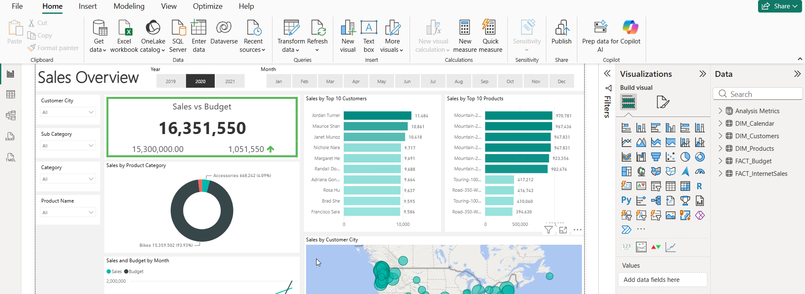
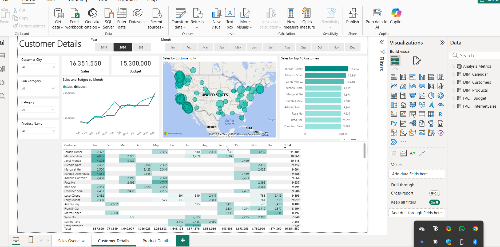
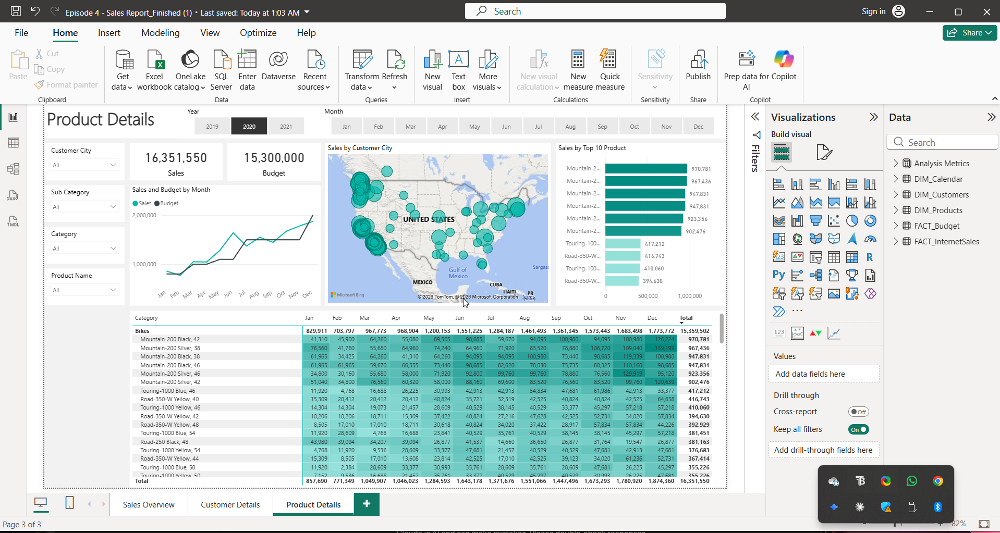
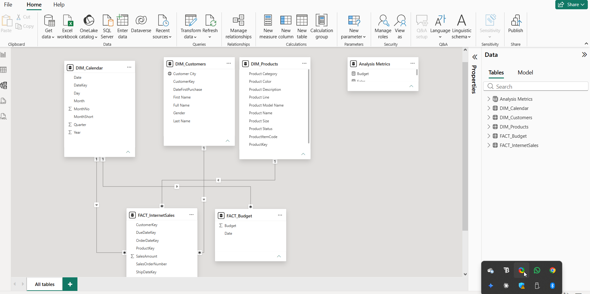

<div align="center">

# 📊 End-to-End Sales Analytics
### Power BI · SQL · Excel · DAX

**Transforming raw sales data into actionable business intelligence through an interactive Power BI dashboard.**


[](https://www.linkedin.com/in/mutyaba-sulah-525510203/)
[](https://github.com/maka971)

</div>

---

## 📑 Table of Contents

- [📸 Dashboard Preview](#-dashboard-preview)
- [🧭 Overview](#-overview)
- [📧 Business Request](#-business-request)
- [📋 Business Demand Overview](#-business-demand-overview)
- [🧑‍💼 User Stories](#-user-stories)
- [🎯 Business Objective](#-business-objective)
- [❓ Stakeholder Questions Answered](#-stakeholder-questions-answered)
- [🛠️ Tools & Technologies](#️-tools--technologies)
- [🧹 Data Preparation & Modeling](#-data-preparation--modeling)
- [🗺️ Data Model](#️-data-model)
- [📊 Dashboard Features](#-dashboard-features)
- [🔍 Key Findings](#-key-findings)
- [💡 Business Recommendations](#-business-recommendations)
- [📌 Business Impact](#-business-impact)
- [🔮 Future Improvements](#-future-improvements)
- [📁 Project Structure](#-project-structure)
- [🚀 Getting Started](#-getting-started)
- [👨‍💻 About the Author](#-about-the-author)

---

## 📸 Dashboard Preview

<div align="center">

| Sales Overview | Customer Details |
|:---:|:---:|
|  |  |

| Product Details | Data Model |
|:---:|:---:|
|  |  |

</div>

> A quick look at the dashboard before diving into the documentation below. Full breakdowns of each page are included in the [Dashboard Features](#-dashboard-features) section.

---

## 🧭 Overview

This project demonstrates a complete end-to-end Sales Analytics solution built using **Power BI**, **SQL**, **Excel**, and advanced data modeling techniques. The goal was to give stakeholders a centralized, real-time view of sales performance — eliminating manual reporting and enabling faster, data-driven decisions.

### ✨ Project Highlights

- 🔁 Replaced static Excel reports with a **real-time, interactive Power BI dashboard**
- 🧱 Designed a **star-schema data model** connecting sales, budget, customer, product, and calendar dimensions
- 📐 Built **6 core DAX measures** to power KPI tracking (Sales, Profit Margin, YoY Growth, AOV, CLV)
- 🗺️ Delivered **3 dashboard pages** (Sales Overview, Customer Details, Product Details) with full cross-filtering and drill-through
- 💵 Reported on **$16.35M** in tracked internet sales against a **$15.3M** budget

### 🧠 Skills Demonstrated

`Data Modeling` · `Power Query (ETL)` · `DAX` · `SQL` · `Star Schema Design` · `Data Visualization` · `Business Requirement Gathering` · `Stakeholder Communication` · `Dashboard UX Design`

---

## 📧 Business Request

> The following email from the Sales Manager initiated this project:

---

**From:** Steven – Sales Manager
**To:** Sulah

Hi Sulah!

I hope you are doing well. We need to improve our internet sales reports and want to move from static reports to visual dashboards.

Essentially, we want to focus it on how much we have sold of what products, to which clients and how it has been over time.

Seeing as each sales person works on different products and customers it would be beneficial to be able to filter them also.

We measure our numbers against budget so I added that in a spreadsheet so we can compare our values against performance.

The budget is for 2021 and we usually look 2 years back in time when we do analysis of sales.

Let me know if you need anything else!

*// Steven*

---

## 📋 Business Demand Overview

| Field | Details |
|-------|---------|
| **Reporter** | Steven – Sales Manager |
| **Value of Change** | Visual dashboards and improved sales reporting for the sales force |
| **Necessary Systems** | Power BI, CRM System |
| **Other Relevant Info** | Budgets have been delivered in Excel for 2021 |

---

## 🧑‍💼 User Stories

| No # | As a (role) | I want (request / demand) | So that I (user value) | Acceptance Criteria |
|------|-------------|--------------------------|------------------------|---------------------|
| 1 | Sales Manager | A dashboard overview of internet sales | I can follow which customers and products sell the best | A Power BI dashboard which updates data once a day |
| 2 | Sales Representative | A detailed overview of internet sales per customer | I can follow up customers that buy the most and identify upsell opportunities | A Power BI dashboard which allows filtering by each customer |
| 3 | Sales Representative | A detailed overview of internet sales per product | I can follow up the products that sell the most | A Power BI dashboard which allows filtering by each product |
| 4 | Sales Manager | A dashboard overview of internet sales | I can follow sales over time against budget | A Power BI dashboard with graphs and KPIs comparing actuals vs. budget |

---

## 🎯 Business Objective

Stakeholders needed a single dashboard to monitor performance across regions, products, customer segments, and sales reps. Key KPIs required:

- 📈 Revenue growth & profit margins
- 🕒 Sales trends over time
- 👥 Customer behavior & segmentation
- 🌍 Product and regional performance

---

## ❓ Stakeholder Questions Answered

| # | Question |
|---|----------|
| 1 | What are total sales, profit, and order volumes over time? |
| 2 | Which products and categories generate the highest revenue and profit? |
| 3 | Which regions and markets are performing best and worst? |
| 4 | Who are the top-performing sales representatives? |
| 5 | What are the monthly and yearly sales trends? |
| 6 | Which customer segments contribute the most revenue? |
| 7 | Are there declining products or underperforming regions needing attention? |

---

## 🛠️ Tools & Technologies


---

## 🧹 Data Preparation & Modeling

<details>
<summary><strong>Click to expand data preparation steps</strong></summary>

- Imported raw sales data from multiple sources
- Cleaned and transformed data using **Power Query**
- Removed duplicates, handled missing values, standardized formats
- Built a **Star Schema** data model for optimal performance
- Established relationships between fact and dimension tables

</details>

### 📐 DAX Measures Developed

| Measure | Description |
|---------|-------------|
| Total Sales | Aggregate revenue across all transactions |
| Total Profit | Net profit after deducting costs |
| Profit Margin % | Profitability ratio per product/region |
| Year-over-Year Growth | Revenue comparison across years |
| Average Order Value | Mean revenue per order |
| Customer Lifetime Value | Long-term customer revenue contribution |

---

## 🗺️ Data Model

The report is built on a **star schema**, connecting one central fact table (`FACT_InternetSales`) and a budget fact table (`FACT_Budget`) to supporting dimension tables (`DIM_Calendar`, `DIM_Customers`, `DIM_Products`) — enabling fast, flexible filtering across every visual in the report.


*Star schema data model showing relationships between FACT_InternetSales, FACT_Budget, DIM_Calendar, DIM_Customers, and DIM_Products.*

---

## 📊 Dashboard Features

### 🗂️ Sales Overview


*Executive-style landing page with Sales vs. Budget KPI, product category breakdown, top 10 customers, top 10 products, and a geographic sales map — all filterable by year, month, city, category, and product.*

- Total Revenue vs. Budget KPI card (with variance indicator)
- Sales by Product Category (donut chart)
- Sales and Budget by Month (trend line)
- Top 10 Customers and Top 10 Products (ranked bar charts)
- Interactive geographic map of sales by customer city

### 👥 Customer Details


*Detailed customer-level view combining a monthly sales-vs-budget trend, a geographic map, a ranked top-10 customer list, and a full customer-by-month sales matrix.*

- Sales and Budget trend by month
- Geographic distribution of customers
- Top 10 Customers ranked by total sales
- Full customer × month sales matrix with grand totals

### 🏆 Product Details


*Product-level breakdown showing top-performing products, monthly sales and budget trends, and a full category-by-month sales matrix.*

- Sales and Budget trend by month
- Top 10 Products ranked by total sales
- Full category × month sales matrix with grand totals
- Cross-filterable by customer city, sub-category, category, and product name

---

## 🔍 Key Findings

### 1. 💰 Revenue Concentration
A small number of products generated the majority of total revenue — indicating heavy dependency on a limited portfolio.

### 2. 🌍 Regional Performance Gap
Certain regions consistently outperformed others, revealing opportunities to replicate winning strategies across underperforming markets.

### 3. 📅 Seasonal Sales Patterns
Sales peaked during specific months, highlighting seasonal demand trends useful for inventory and marketing planning.

### 4. 👤 Customer Value Distribution
A small percentage of customers contributed a significant share of total revenue — underscoring the importance of targeted retention efforts.

### 5. 📉 Profitability Variations
Several high-revenue products delivered low profit margins, pointing to pricing inefficiencies or cost-management opportunities.

---

## 💡 Business Recommendations

| Area | Recommendation |
|------|----------------|
| **Product Strategy** | Focus marketing on high-margin products; review pricing for low-profit, high-volume items |
| **Regional Performance** | Investigate top-performing regions and replicate strategies in lagging markets |
| **Customer Retention** | Build loyalty programs for high-value customers; increase engagement with repeat buyers |
| **Sales Forecasting** | Use historical trends and seasonality for accurate demand forecasting |
| **Team Performance** | Set KPI benchmarks; provide coaching to underperforming reps |

---

## 📌 Business Impact

| Before | After |
|--------|-------|
| Manual, time-consuming reporting | Real-time automated dashboard |
| Siloed data across teams | Centralized single source of truth |
| Reactive decision-making | Proactive, data-driven strategy |
| Limited visibility into trends | Full trend analysis and forecasting |

---

## 🔮 Future Improvements

- ⏱️ Automate daily data refresh via Power BI Service / Gateway
- 🤖 Add forecasting visuals using Power BI's built-in AI forecasting or Python integration
- 📱 Optimize dashboard layout for mobile view
- 🔔 Add alerts for budget variance thresholds
- 🧮 Expand DAX measure library (e.g., cohort retention, basket analysis)

---

## 📁 Project Structure

```
sales-analytics-powerbi/
│
├── 📂 data/
│   ├── raw/               # Original source data
│   └── processed/         # Cleaned and transformed data
│
├── 📂 dashboard/
│   └── SalesAnalytics.pbix  # Main Power BI file
│
├── 📂 images/
│   ├── dashboard-overview.png
│   ├── customer-details.png
│   ├── product-details.png
│   └── data-model.png
│
├── 📂 sql/
│   └── queries.sql          # SQL scripts used for data extraction
│
├── 📂 docs/
│   └── data_dictionary.md   # Column definitions and schema overview
│
└── README.md
```

---

## 🚀 Getting Started

1. **Clone the repository**
   ```bash
   git clone https://github.com/maka971/End-to-end-sales-data-project-
   ```

2. **Open the report** in Power BI Desktop:
   [Episode 4 - Sales Report_Finished.pbix](https://github.com/maka971/End-to-end-sales-data-project-/blob/main/Episode%204%20-%20Sales%20Report_Finished.pbix)

3. **Connect your data source** via Power Query (update connection strings as needed)

4. **Refresh the data** and explore the dashboard

---

## 👨‍💻 About the Author

**Sulah Mutyaba**
Data Analyst | Power BI Developer | SQL | Python

- 💼 LinkedIn: [linkedin.com/in/mutyaba-sulah-525510203](https://www.linkedin.com/in/mutyaba-sulah-525510203/)
- 💻 GitHub: [github.com/maka971](https://github.com/maka971)

---

<div align="center">

*Built as part of a data analytics portfolio. Open to feedback and collaboration.*

</div>
